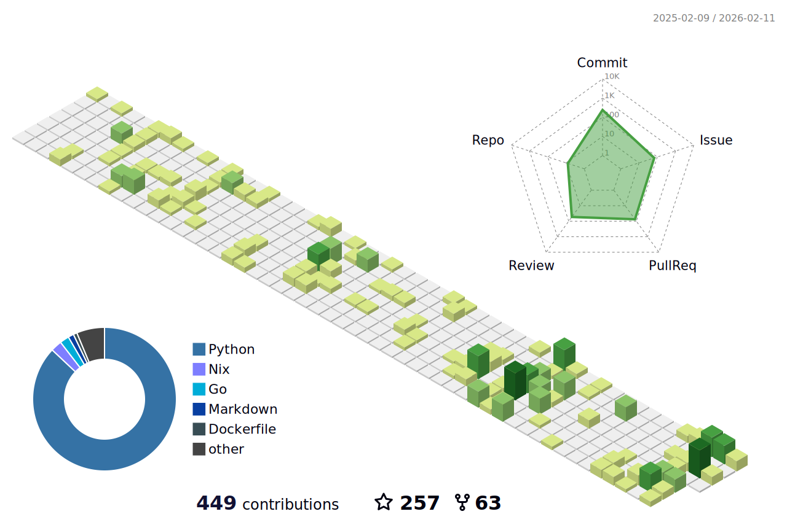
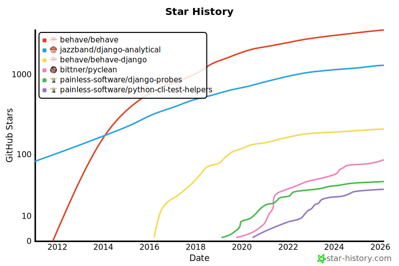

## Hi! 👋

I'm a long-time Python developer and a loyal Linux user. 🐍  
I show development teams how to work effectively with cloud technologies, automation and AI. 🤖  
I live, breathe, use, study, share, create and improve free and open source software. 🐧  
Some substantial parts of the work I do is [on GitLab](https://gitlab.com/painless-software). 🦊  

## Contribution Activity 👨‍💻

## Popular Projects 🛒

Here are some of the more popular projects that I work on as a maintainer or co-maintainer. 🚀  

